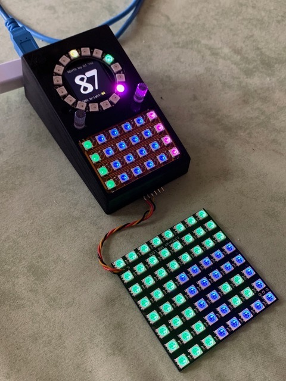

# BEATS
## Beat Couter, MIDI controller and DMX light controller in one

A small box that is connected to the computer via USB and shows the beat as a clock and digits so that can be mixed in the beat. It can be used as a MIDI and DMX controller and can control a lighting system in the beat.

 

The Beat Counter knows 3 operating modes:

- MIDI (beat clock and metronome)
- Scanners (and moving heads with up to 8 scanners with 8 channels or 4 scanners with up to 16 channels)
- COB (Pixbar and Pattern)

Can be operated with anything that sends MIDI commands: Ableton Live, Serato, Traktor …

Beat length adjustable, inclined beats such as 9 are also adjustable.
The key matrix is pressure-sensitive and illuminated with RGB LEDs. A milky silicone pad is attached to the key matrix.
There are two illuminated encoders that are used to set the lighting system and can also send MIDI signals.
Reads and writes MIDI signals via USB and DIN socket.
Outputs DMX control signals for light control for COB bars, 8x8 COB arrays and scanners / moving heads. Up to 8 scanners / moving heads can be controlled at the same time.
SD card slot accessible from the rear.
The housing is designed with OpenSCAD and is printed with 3D printers (Form3 or FDM)
The current version uses a Teensy 3.6, the next version will have a Teensy 4.1 (600Mhz).
The board is two-sided and created with Eagle.

Here some videos: 
- Controlling scanners / moving heads: https://www.youtube.com/watch?v=9kyjajE7mRk
- Animation of the circuit board: https://www.youtube.com/watch?v=K_6d6vQXQpI 
- Inner workings with a few functions: https://www.youtube.com/watch?v=Ms0J2bLOR1w 
- 4 x Showtec Pixel Square 16 COB (old version): https://www.youtube.com/watch?v=BX3hZSje4Ws
- Also works with bars (old version): https://www.youtube.com/watch?v=ibh8aw3B2aw
- MIDI Beat Counter Setup and Menues Part 1: https://www.youtube.com/watch?v=dCm0thBqy6s
- MIDI Beat Counter Setup and Menues Part 2: https://www.youtube.com/watch?v=OodJnmjo3fk

In MIDI mode, the key matrix is used as pressure-sensitive pads for e.g. Ableton Live. All buttons send MIDI commands. The two encoders send MIDI commands for buttons and each can be switched between 3 settings. MIDI channel and address can be set.

The scanner mode is used to control up to 8 scanners or moving heads with 8 channels or 4 scanners with up to 16 channels. All settings such as pan, tilt, color, strobe etc. can be set individually for each scanner and up to 32 settings can be saved by now.

In movement mode there are 9 movement patterns such as Left-Right, Circle, Swing etc. which the scanner let move to the rhythm of the music. The movement path and speed can be selected, in beat in steps and free run mode.

The COB mode is for COB-LED walls, until now for a matrix of 8x8 COBs. A counting pattern can be set or programmed patterns can be send out. The patterns run to the beat of the music, foreground and background brightness can be adjusted. Lightbulbs are simulated, slowly decay.

The housing is designed to be as stable as possible. On the underside there are bars under the key matrix so that nothing can bend or break even with firm pressure. The two screws for the circuit board are in the immediate vicinity of the encoder, even here nothing can be broken by applying too much pressure to the encoder. An M8 nut will also be integrated into the housing on the underside so that the device can also be screwed on. The size of the Beat Counter is kept compact and can therefore be mounted within sight.

## Further development:

The USB host port can be used to connect external devices, keyboard, drum pads etc. (Korg, Akai) https://www.pjrc.com/wp-content/uploads/2020/05/teensy41_usbhost3.jpg https://forum.pjrc.com/teensy41_usbhost2.jpg

Explanation to DMX: https://en.wikipedia.org/wiki/DMX512#RJ-45_pinout

In the current device I am using a Teensy 3.6. I am developing a circuit board for the Teensy 4.1. Teensy 4.1: https://www.pjrc.com/store/teensy41.html

Instead of the MIDI-DIN socket, an RJ45 socket will be installed: Ethernet can be used to beat-link CDJs such as beat-link-trigger or for Art-Net

Art-Net: https://artisticlicence.com/WebSiteMaster/User%20Guides/art-net.pdf

Conversion of the pattern for the COB-LED walls to the SD card and writing the program for generating the pattern, then larger output than 8x8 are possible.

Teensy 4.1 can use S/PDIF and can be later used for sound analysis, Fourier transformation and as an effects device: https://en.wikipedia.org/wiki/S/PDIF

The displays are also available in round. This display can be exchanged 1: 1 (same driver ST7789): 250nits: http://www.panelook.com/TVT0128A-I-IPS-1-28-Inch-240x240-Round-TFT-LCD-Circular-Display-Module-For-VR-detail_71679.html 400nits: http://www.panelook.com/TVT0128C-I-IPS-1-28-Inch-240x240-Round-TFT-LCD-Circular-Display-Module-For-VR-detail_98507.html or as OLED with 400x400 resolution, but are quite expensive and probably too slow: https://www.ebay.de/itm/Real-AMOLED-Display-1-39-inch-400-400-Round-Circle-Circular-OLED-LCD-Module/192716558403?var=492858328484

An LED strip control can also be installed, the neopixels are already controlled like this: https://www.ebay.de/itm/WS2812B-LED-Streifen-Strip-5M-WS2812-RGB-Leiste-Licht-5050-SMD-Adressbaren-DC5V/222192610445?hash=item33bbb62c8dⓂ️m48DHbcLw8Ppkncw-fkDSGA

Something else interesting could easily be integrated: https://github.com/saikoLED/TeensyLED

If someone is interrested to build it, I still have some PCB's and can send for 10 Euros each plus shipping costs. For further questions send email to g.zi@gmx.de